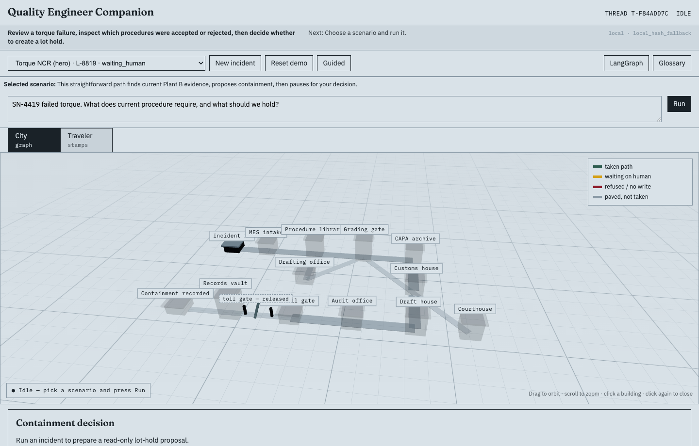
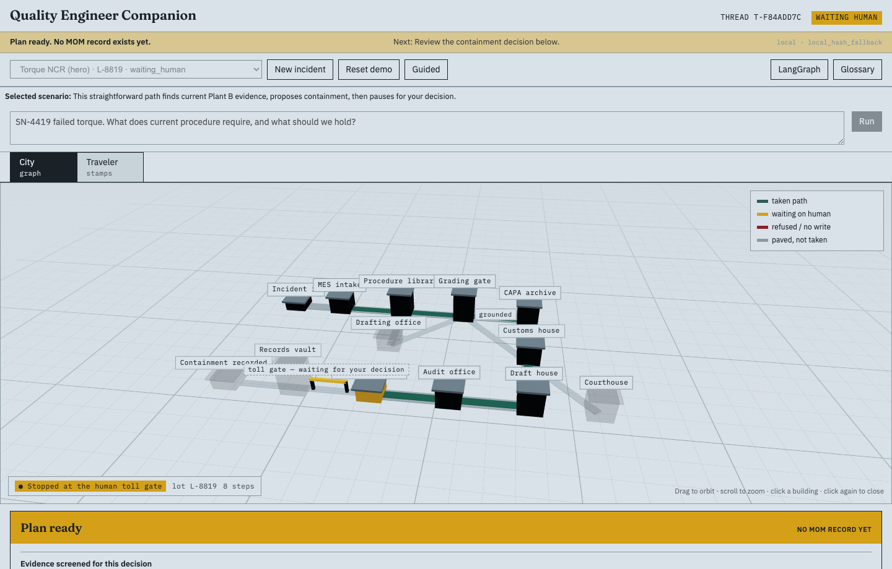
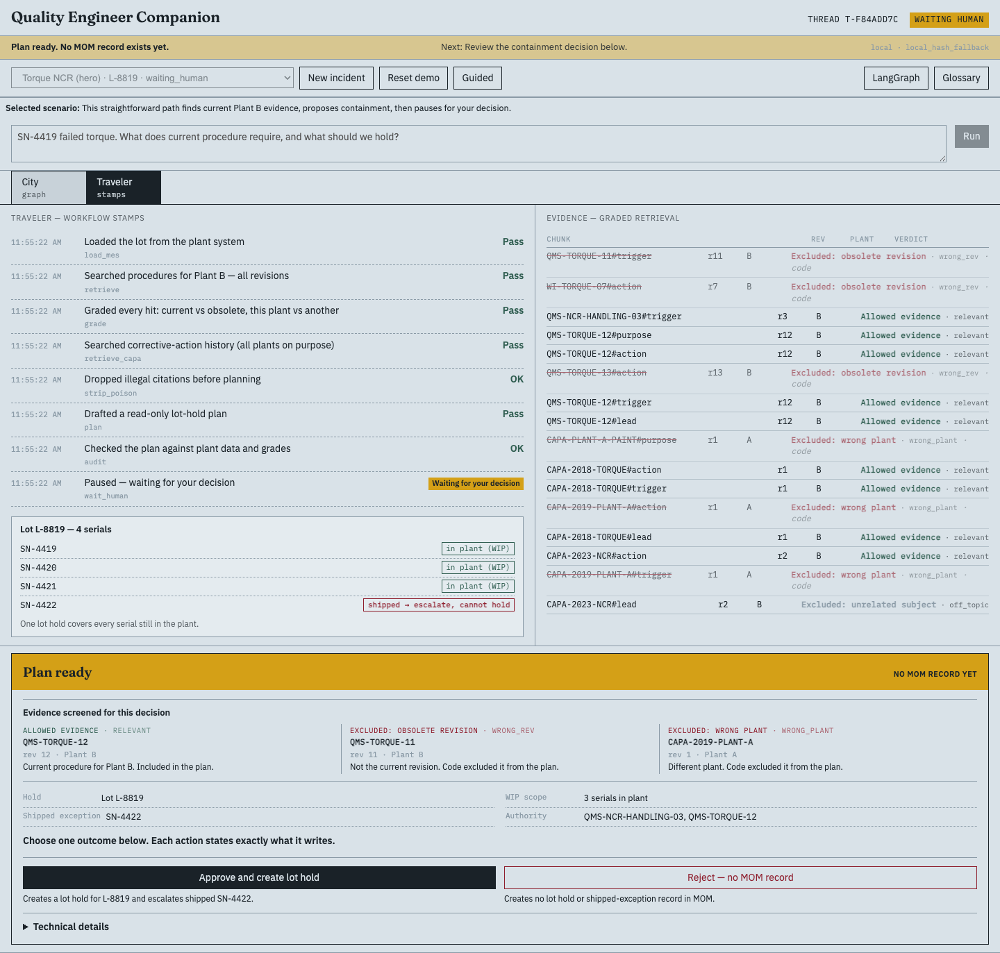
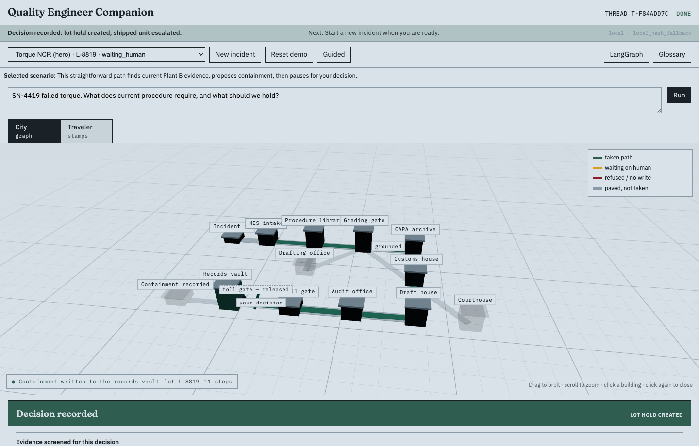
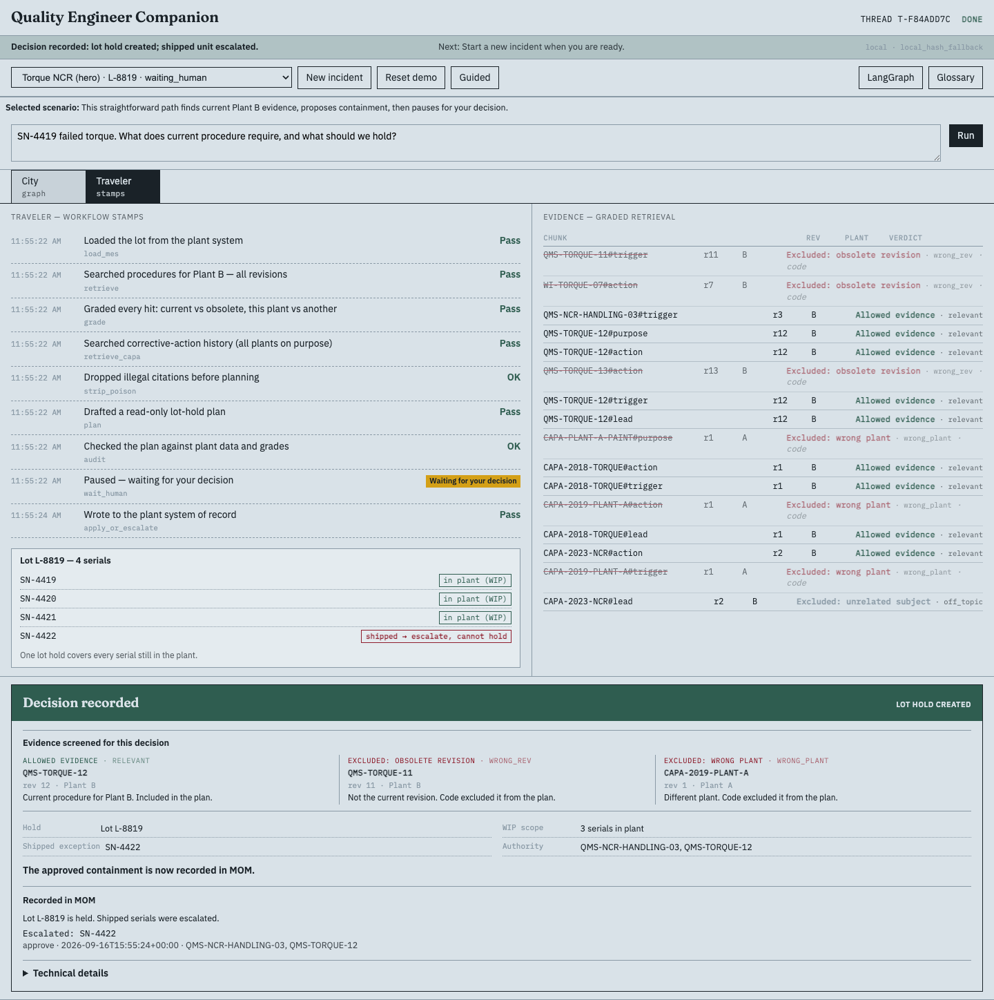

# Quality Engineer Companion

A LangGraph + RAG workflow for plant quality.

A **Plant B** quality engineer gets a torque failure on serial **SN-4419**
(lot **L-8819**). A LangGraph workflow searches revisioned SOP/CAPA documents
with hybrid retrieval (BM25 + dense, overlap rerank), then **grades every hit**:
a local heuristic judges topic (Gemini if a key is set), but **code** — never
the model — declares obsolete revisions (`wrong_rev`) and wrong-plant lookalikes
(`wrong_plant`) illegal to cite. It drafts a read-only lot-hold plan and
**stops for human approval** before writing anything to a mock MOM (SQLite).
Nonsense queries must abstain.

> The model retrieves and proposes. Code owns plant state and current revision.
> A human approves a lot hold. Mock MOM is the system of record.

The product name is **Quality Engineer Companion** (traveler UI and API).

## How it works

The model retrieves and proposes. Code owns plant and current revision. A human
approves before mock MOM is written. Graph and layer diagrams:
[`docs/architecture.md`](docs/architecture.md).

**New here?** Run locally below. Walkthrough: [`demo/DEMO.md`](demo/DEMO.md).
Agent rules: [`AGENTS.md`](AGENTS.md). License: [MIT](LICENSE).

## Console

Torque NCR in both watch modes: city (graph) and traveler (stamps).

**Idle**



**Waiting human** — plan ready, no MOM write yet. City shows the yellow toll gate; traveler shows graded traps and Approve / Reject.





**Recorded in MOM** — after Approve. Lot L-8819 held, shipped SN-4422 escalated.





---

## Click and run (local)

```bash
python3 -m venv .venv && source .venv/bin/activate
pip install -e ".[dev]"
cp .env.example .env            # optional GOOGLE_API_KEY; local provider without it

python -m companion serve       # terminal 1 — FastAPI on 0.0.0.0:8000
```

```bash
cd qe-console                   # terminal 2 — Vite on :5173
npm install
npm run dev                     # open http://localhost:5173
```

No password locally. Pick a scenario → **Run**. After done / abstained /
rejected, **Run** mints a new incident automatically. **Reset demo** reseeds
MOM so leftover holds do not leak into the next scenario. **Publish QMS-TORQUE 13**
(after the yellow tag is finished) moves the current-rev pointer; Run Torque NCR
again to see rev 12 graded `wrong_rev` and the plan cite 13. Reset restores 12.

## Docker (one process, UI + API)

Visitors never paste an API key. If `GOOGLE_API_KEY` is set in the host
environment, the server uses Gemini; otherwise it stays on the local provider.
The image is overlap-rerank only (no MiniLM).

```bash
docker compose up --build
# open http://localhost:8000
```

Optional Gemini at runtime (not baked into the image):

```bash
GOOGLE_API_KEY=your-key docker compose up --build
```

Optional password on a **public** host (local/compose stay open when unset):

```bash
DEMO_PASSWORD=choose-a-password docker compose up --build
```

The UI shows a password field; `/health` stays public so you can see
`auth_required`.

Cross-encoder rerank is a **local extra**, not in the Docker image:

```bash
pip install -e ".[rerank]"
COMPANION_RERANK=1 python -m companion serve
```

## Verify (all green = healthy)

```bash
pytest -q                        # unit + API + restart-resume
python -m companion eval         # gold + 10 scenarios, "ok": true (forced local)
python -m companion eval --models  # optional; writes companion/eval/model_card.json
cd qe-console && npm run probe   # Playwright walk of all 10 scenarios
```

`eval --models` always records the local contract. If `GOOGLE_API_KEY` is set
it also replays the ten scenarios on Gemini (latency, fallback count, pass/fail).
With no key, Gemini is skipped so CI stays green.

| Provider | When | What the card records |
| --- | --- | --- |
| local | always | contract pass/fail, latency, fallback count (0) |
| gemini | key present | same; `fallback_count` if quota/timeout hit local helpers |
| gemini | no key | `skipped: true` — not a CI failure |

## What is where

| Path | Job |
| --- | --- |
| `companion/` | FastAPI + LangGraph + hybrid RAG + SQLite mock MOM (**the product**) |
| `qe-console/` | Vite + React inspection-traveler console |
| `companion/corpus/` | ~20 revisioned markdown procedures/CAPAs, including deliberate traps |
| `demo/DEMO.md` | Walkthrough script |
| `docs/architecture.md` | Graph and layer diagrams |
| `docs/screenshots/` | README console stills (no hosted demo required) |

## How to demo (90 seconds)

Whiteboard the graph: retrieve → grade → (rewrite once) → CAPA → poison-strip →
plan → audit → **interrupt** → apply. Then run Path A live: rev 11 was *supposed*
to be retrieved — code, not the model, marked it obsolete. Plant A CAPA is the
wrong-plant trap versus **Plant B**. At the yellow tag, kill the server and
restart: the disk checkpointer plus persisted thread state lets you resume the
same incident — no write ever happened without a human. Garbage query abstains:
refusing is a feature. Close with `eval` + tests green and the per-thread
decision log on the holds pane.
