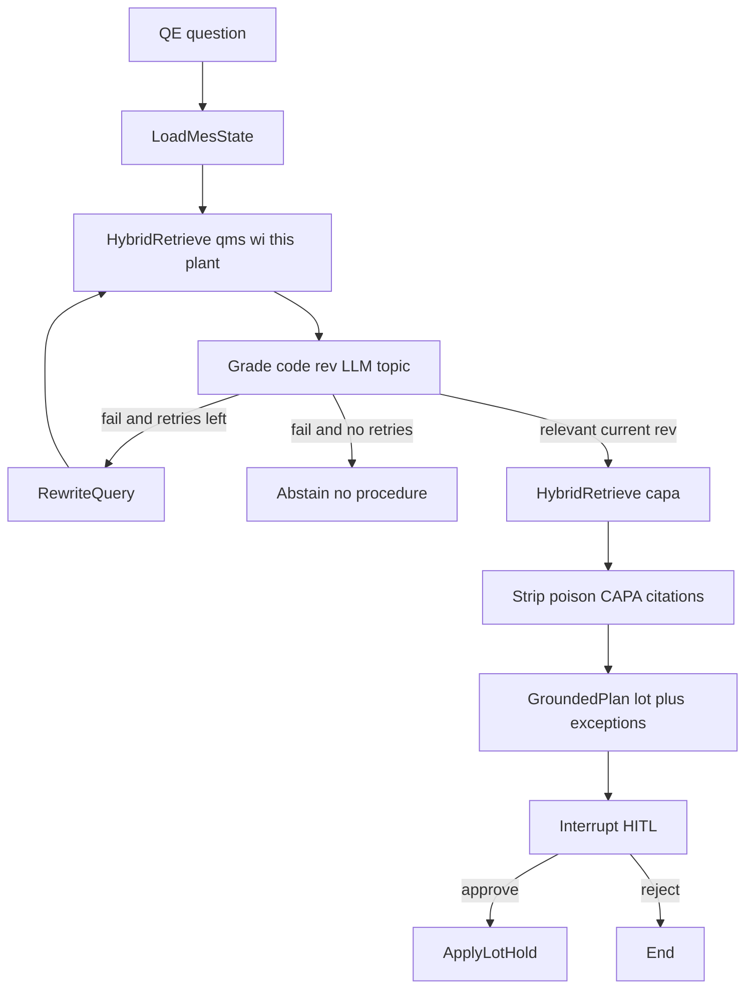
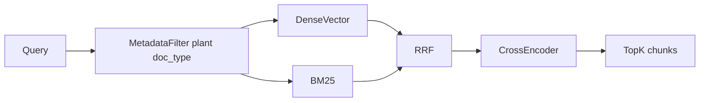
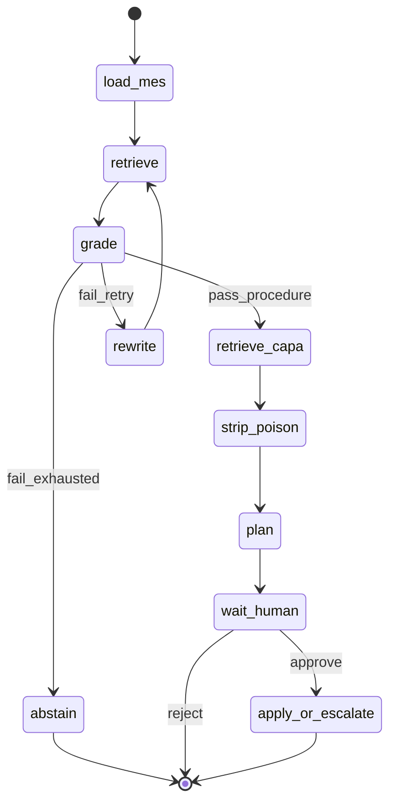

# Quality Engineer Companion

> **As built (2026-08-23):** implementation is complete and verified. Deltas
> vs this pre-build design: disk checkpointer + restart
> resume are live; embeddings are Gemini-with-cache or honest local fallback
> (`/health` tells you which); rerank defaults on; a **faithfulness audit**
> node runs between `plan` and `wait_human` (citations ⊆ surviving chunks,
> exceptions == shipped serials — violations fail the run before the human).
> The state diagram below now reads `plan → audit → wait_human`.

**Status:** Scenario and AI-layer design. UI/API: [QE_CONSOLE_ARCHITECTURE.md](QE_CONSOLE_ARCHITECTURE.md).  
**Audience:** Manufacturing quality / AI engineering.  
**Hero layers:** RAG and LangGraph. MOM is a thin skin, not the product.

The working system is the Python package (`companion/`).

**One-liner:** The model retrieves and proposes. Code owns plant state and current revision. A human (QE) approves a **lot** hold. Mock MOM is the system of record.

---

## Locked decisions (grill)

Pass bar, in order: **(1)** graph wait → resume without losing state; **(2)** hybrid retrieve + visible `wrong_rev` / `wrong_plant` grades. Typed apply is the closer. Eval is homework. The four-serial story is a skin.

| Topic | Decision |
| --- | --- |
| Metadata filter | **Plant + `doc_type` only.** Do **not** filter out obsolete rev. Rev 11 must enter retrieve so grade can label `wrong_rev`. |
| Current rev | **Code table** `(doc_stem, plant) → current_rev`. Example: `QMS-TORQUE` @ B → `12`. Not the LLM. |
| Grade split | **Code:** `wrong_rev` if `chunk.rev != current_rev`; `wrong_plant` if `chunk.plant != query plant`. **LLM:** `relevant` \| `off_topic` only. |
| Retrieve B (CAPA) | **Poison gate, not absence gate.** Drop / refuse to **cite** `wrong_plant` or `wrong_rev` CAPA. Empty good-CAPA set → still propose hold from procedure. Do **not** abstain for lack of history. |
| Hold grain | **Lot hold** `L-8819` + **exception** `SN-4422` shipped → escalate. Not a list of serial holds pretending to be MES. |
| Index | **One** chunk store. Retrieve A: `doc_type in (qms, wi)`. Retrieve B: `doc_type = capa`. |
| Eval illegal | **Cut** “start task anyway.” Illegal = write before HITL, or apply a hold that includes a shipped serial as if it were WIP. Abstain = garbage query / no passing procedure chunks. |

---

## Why RAG and LangGraph (and what else we could use)

They solve **different** problems. Neither replaces the other.

### Why RAG

Procedure truth lives in **revisioned documents** (`QMS-TORQUE-12` vs obsolete rev 11, Plant A CAPA vs Plant B). That text changes when quality updates a WI. Fine-tuning yesterday’s SOP is how you ship wrong authority.

RAG means: search the corpus at ask-time, pass only those chunks to the model, **cite them**. Generation may word the answer; it may not *be* the procedure.

In this scenario that matters because:

- **Plant** is a retrieve filter. **Revision** is the RAG exam (rev 11 must be retrieved, then graded out in code).
- QE needs **citations**. A raw LLM cannot prove it read the doc.
- Trap CAPAs are **near-duplicates**. That is retrieval/grading, not a bigger model.
- Lot / ship status stay in SQLite. RAG is only for **unstructured** policy.

**If we skipped RAG:** dump every SOP into context (no ranking; traps still win) or trust parametric memory (no citations; stale revs).

### Alternatives to RAG

| Alternative | Fit for this scenario |
| --- | --- |
| Prompt stuffing (all ~20 files) | Works on a toy corpus. No ranking, no scale. Not the skill being hired. |
| BM25 only | Strong on SOP IDs and `torque`. Weak on paraphrase. |
| Dense only | Strong on paraphrase. Weak on `L-8819`, `NCR-1042`. Hybrid exists because both appear. |
| Fine-tune / LoRA on SOPs | Revs change; cannot cite; cannot drop wrong-plant without another system. |
| SQL / rules only | Correct for ship status and current-rev table. Incomplete for explaining procedure. **Keep this next to RAG.** |
| Knowledge graph of SOP triples | Heavy for v1. Lot siblings already live in SQL. |
| FAQ cache | Fine as **eval**, not as the product. |

**Split:** RAG for docs. Code/SQL for plant state **and** current revision.

### Why LangGraph

RAG is a **function** (query in, chunks out). This product is a **workflow**: load MES → retrieve procedure → grade → maybe loop → retrieve CAPA → strip poison citations → plan → **pause for QE** → apply lot hold or escalate.

A single `chain.invoke(question)` cannot loop, pause, or resume with the same state. LangGraph is a state machine whose nodes call RAG, LLMs, or Python, with persistence.

In this scenario that matters because:

- Grade → rewrite → retrieve is a **cycle**. Chains are DAGs.
- HITL is an **interrupt + checkpoint**, not `input()`.
- QE resume is `thread_id`, not rerunning from scratch.
- `apply_hold` must not be an LLM token. It runs **after** approval.
- CAPA poison strip is a **node**, not a prompt hope.

**If we skipped LangGraph:** a Python `if/else` state machine. Same ideas, weaker match to the job posting.

### Alternatives to LangGraph

| Alternative | Fit for this scenario |
| --- | --- |
| Plain Python | Enough for v1 if we own interrupt/resume. Weaker JD signal. |
| LangChain LCEL chain | Fine for one-shot SOP Q&A. No bounded retry, HITL, or resume. |
| ReAct / single tool-calling agent | Can call retrieve and `apply_hold`. Risk: model holds **before** HITL. Graph makes “no write before interrupt” structural. |
| Multi-agent (Crew, AutoGen) | Extra chatter. This job is one QE, one graph. |
| Temporal / Step Functions | Right at plant scale. Overkill for the demo. |

**When we would not use LangGraph:** SOP chatbot with one retrieve and one answer. The moment we add grade-loop + HITL + apply, we need an orchestrator. LangGraph is the one named in the posting.

---

## Goal and non-goals

**Goal:** One incident, one QE user, two retrieve jobs on **one** store (procedure + CAPA), a corrective RAG loop, a typed **lot** hold with shipped exception, HITL, checkpoint resume. Eval is secondary: abstain + no pre-HITL write + no treating shipped as WIP.

**Non-goals:** Execution Cockpit, operator “start task,” full 8D, Global Containment Manager, warehouse dock-holds, Time & Labor certs, Machine Integrator, vision, and fine-tuning.

**Pass bar (20 minutes):** She can redraw loop + interrupt + checkpointer; you resume a thread. Then show rev 11 and Plant A CAPA **graded**, not silently filtered. Apply is the last minute.

---

## Single story (thin MOM)

Plant B. Serial `SN-4419` fails torque. Lot `L-8819`. Siblings `SN-4420`, `SN-4421` (WIP). `SN-4422` already shipped.

QE asks: *“SN-4419 failed torque. What does the current procedure require, and what should we hold?”*

1. Load plant snapshot from SQLite (lot, serial statuses). No LLM.
2. **Retrieve A** (`doc_type` qms/wi, **this plant**, **all revs**).
3. Grade: code marks `wrong_rev`; LLM marks `off_topic`. If no `relevant` current-rev chunk: rewrite once → retrieve again → else **abstain** (no plan).
4. **Retrieve B** (`doc_type` capa, this plant filter off for the trap: **no plant filter on CAPA** so Plant A can appear — then code grades `wrong_plant`).
5. **Poison gate:** CAPA chunks with `wrong_plant` / `wrong_rev` must not appear in `sop_ids` / citations. If none remain, continue with procedure-only evidence.
6. Generate cited explanation + `ContainmentPlan` (lot + exceptions). Code strips any shipped serial out of the hold grain.
7. Interrupt. QE approves. Mock MOM writes **lot hold** + **shipped exception**. No per-serial hold rows.

Combo X (operator interlock → full 8D) stays a **verbal** extension.



---

## Why each RAG stage exists

Corpus (~20 markdown files), not a scrape:

- Current: `QMS-TORQUE-12` (LB, rev 12, effective).
- Trap: `QMS-TORQUE-11` (obsolete rev, **same plant** so it survives plant filter), `CAPA-2019-PLANT-A` (same title, other plant), `WI-UNRELATED` (semantic near-miss).
- **Current-rev table** in code/SQLite, not in prose. Docs must not store genealogy.

**Chunking:** Split on SOP headings (purpose / trigger / action / authority). Metadata: `doc_id`, `doc_stem`, `rev`, `effective_date`, `plant`, `doc_type`.

**Filter before cosine:** `plant = LB` on procedure retrieve; `doc_type` per retrieve job. **Not** `rev = current`.

**Hybrid retrieve:** Dense (Gemini embeddings) + BM25 on codes (`L-8819`, `NCR`, `torque`, SOP IDs), then RRF merge. One vector cache, `doc_type` metadata.

**Rerank:** Cross-encoder on top 8 → top 3.

**Grade:** Code compares `rev` to current-rev table and `plant` to query plant. LLM only `relevant` / `off_topic`. Cycle is: no surviving **procedure** chunk → rewrite once.

**Rewrite (once):** If procedure grade leaves nothing relevant at current rev, rewrite with defect + plant + “current revision.” CAPA miss does **not** trigger rewrite.

**Generate + faithfulness:** Citations ⊆ kept (non-poison) chunk ids. Lot/exception membership from SQLite, not from the prompt.

**Eval:** current-rev citation wins over rev 11; Plant A CAPA not in `sop_ids`; garbage query abstains; apply never runs before interrupt; shipped serial is an exception, not a hold target.



---

## Why each LangGraph piece exists

LangGraph is justified **only** by branch, loop, pause, resume. A linear retrieve-then-generate chain would be LangChain.

**State** (`TypedDict`): `query`, `plant_state`, `query_rewritten`, `retrieved`, `grades`, `retry_count`, `plan` (Pydantic or None), `human_decision`, `status`. Reducers on `retrieved` / messages. QE resumes the same `thread_id`.

**Nodes:** `load_mes` (code) → `retrieve` → `grade` → `rewrite` → `retrieve_capa` → `strip_poison` → `plan` → `wait_human` → `apply_or_escalate`. `load_mes`, rev/plant grade, `strip_poison`, and `apply` never call an LLM for authority.

**Conditional edges:**

- After procedure `grade`: at least one `relevant` current-rev chunk → `retrieve_capa`; else if `retry_count < 1` → `rewrite`; else → `abstain`.
- After `strip_poison`: always `plan` if procedure survived (CAPA may be empty).
- After `wait_human`: approve → `apply_or_escalate`; reject → END.
- Inside `apply_or_escalate`: insert lot hold; insert shipped exceptions; **never** `apply_hold` on a shipped serial as WIP.

**Cycle cap:** `retry_count` max 1, procedure retrieve only.

**HITL:** `interrupt` before any SQLite write.

**Checkpointer:** SQLite saver with `thread_id=ncr-1042`. Demo: kill after plan, resume `{decision: approve}`.



---

## Thin MOM data (supporting cast)

SQLite:

- `serials` (id, lot_id, status `wip|shipped`) — **read** for expansion and exceptions. Not the hold grain.
- `current_revs` (`doc_stem`, `plant`, `rev`) — grade oracle.
- `holds` (`lot_id`, `reason`, `sop_ids`, `thread_id`) — written only after approve.
- `hold_exceptions` (`lot_id`, `serial_id`, `kind` e.g. `shipped_escalate`).
- `actions` — audit of approved plans.

Seed: four serials on `L-8819` as above. Tool: `siblings_of(lot)` for display, not for writing serial holds.

`ContainmentPlan`:

```python
lot_id: str                    # L-8819
sop_ids: list[str]             # current-rev procedure; never poison CAPA
exceptions: list[{serial_id, kind}]  # SN-4422 shipped_escalate
```

Code builds exceptions from `serials.status == shipped`. The LLM does not choose the lot vs serial grain.

---

## Runtime and layout

New package, do not fold into `app.js`:

- `companion/corpus/*.md` — revisioned SOPs/CAPAs plus traps
- `companion/rag/` — chunk, embed, BM25, RRF, rerank, grade, faithfulness
- `companion/graph/` — StateGraph, nodes, routers
- `companion/mom/` — SQLite seed + `apply_lot_hold`
- `companion/eval/` — gold JSONL + runner
- CLI: `python -m companion ask` (server mints `thread_id`) or `ask --thread ncr-1042 "..."` then `resume --decision approve`. HTTP: POST start **202**, GET `/events` for SSE — see console doc. Do not POST a stream.

Stack: Python 3.11+, `langgraph`, Gemini Flash + `gemini-embedding-2` (see console doc), `rank-bm25`, local MiniLM cross-encoder, Pydantic. LLM for topic grade / rewrite / plan wording only.

Frontend/backend: [QE_CONSOLE_ARCHITECTURE.md](QE_CONSOLE_ARCHITECTURE.md).

---

## Demo (about 8 minutes)

1. Whiteboard: plant filter, **rev in retrieve**, code current-rev table, loop, interrupt, lot hold.
2. Chip **Torque NCR**; show rev 11 in retrieved set with `wrong_rev`; Plant A CAPA `wrong_plant` and **absent from `sop_ids`**. Plan is read-only; Approve.
3. **New incident**, chip **Garbage query** → rewrite → or abstain (procedure miss only).
4. Plan JSON: `lot_id=L-8819`, exception `SN-4422`; interrupt; resume approve; `holds` row + `hold_exceptions` row.
5. Eval: no `apply` before interrupt; shipped not written as a normal hold.

If asked about a real MOM: *same graph would emit this payload to the plant system of record; we did not build MES.*

---

## What “done” means for this layer

- Hybrid retrieve + procedure rewrite loop + CAPA poison strip implemented, not described.
- Graph has a cycle, an interrupt, and a checkpointer; you can resume a thread. **This is the pass bar.**
- Eval matches the compiled graph (no start-task case).
- MOM surface is lot hold + exceptions. Combo X / 8D stay verbal.

---

## Build order (when implementation starts)

1. Corpus + `current_revs` + serial seed (`L-8819`, one shipped).
2. One index: chunking, Gemini embed cache, BM25, RRF, rerank, code rev/plant grade, LLM topic grade, rewrite, poison strip, faithfulness.
3. StateGraph as in the state diagram; HITL; `apply_lot_hold`.
4. Eval JSONL + CLI ask/resume.
