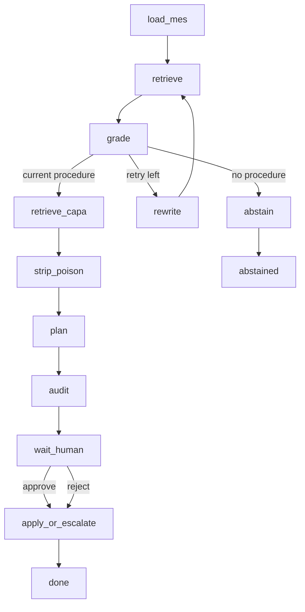
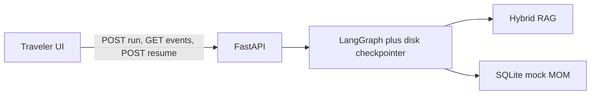

# How it works

The model retrieves and proposes. **Code** owns plant and current revision.
A human approves a lot hold. Mock MOM (SQLite) is the system of record.

City view in the console is the same graph drawn as buildings and roads.
This page is the static version.

## Graph

Matches `companion/graph/build.py`. Topic grade is a local heuristic (Gemini
if a key is set). `wrong_rev` and `wrong_plant` are **code**, never the model.
Traps stay searchable so the demo can show *retrieved, then rejected*.

Approve writes a **lot** hold plus shipped exceptions. Reject still runs
`apply_or_escalate` so the thread ends cleanly, with **no** MOM write.
`audit` runs before the human: plan citations must be kept evidence.

Rewrite is at most once (`retry_count < 1`), procedures only.

## Layers

The browser never holds `GOOGLE_API_KEY`. Retrieval is BM25 + dense, then
overlap rerank. MiniLM is a local extra (`COMPANION_RERANK=1`), not in Docker.

Kill the server at the yellow tag, restart, resume the same thread: the
checkpointer plus persisted state hold the interrupt. Nothing was written
until Approve.
